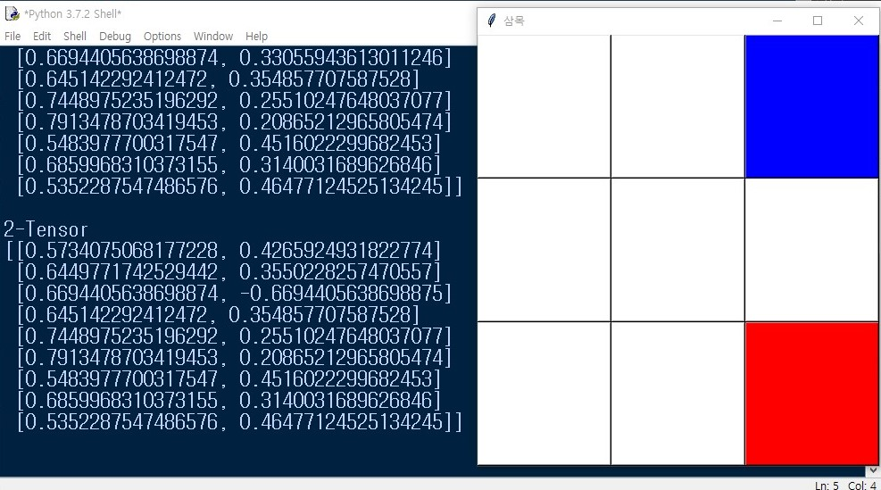

tic tac toe
=========

>참고!! 위 스크린 샷은 학습이 덜 된 상태에서 찍었습니다.
# 1.설명
파이선의 기본 라이브러리로만 가지고 구현한 삼목 게임입니다. 게임 방법 먼저 삼목을 차지한 사람이 이기고, 플레이어는 인공지능과 대전하게 됩니다.
>참고!! 학습된 신경망과 데이터는 제공하지 않습니다. 아래의 설명을 참고하여 데이터를 생성하고 학습해야 합니다!

# 2.구조 설명
크게 3가지로 분리가 됩니다.

1. 텐서 패키지
2. 레이어 모듈
3. tic tac toe관련 모듈들

텐서 패키지는 텐서의 연산을 직접 구현한 패키지로, [tensor](tensor/README.md) 폴더 전체가 이에 해당됩니다.

레이어 모듈은 [layer.py](layer.py) 신경망의 레이어로, 위 텐서 패키지를 가지고 구현되어 있습니다.

tic tac toe 관련 모듈들은 나머지 모듈들을 말하고, 데이터 생성 모듈, 학습 모듈, 게임 모듈이 있습니다.

# 3.게임 방법

1. [init_data.py](init_data.py)로 init()함수를 호출해서 데이터를 생성하고 pickle로 덤프합니다.
2. [레이어생성.py](레이어생성.py)로 create_layer()함수로 신경망을 생성하고 pickle로 덤프합니다.
3. [학습.py](학습.py)를 실행하면 자동으로 무한번 학습합니다.
>참고!! 학습은 200번 주기로 pickle로 덤프하여 저장합니다.
4. [tk.py](tk.py)로 게임을 실행합니다.
5. 화면을 클릭해서 게임을 진행합니다.
>참고!! 콘솔 창의 출력에서는 신경망의 순전파 결과를 볼 수 있습니다.